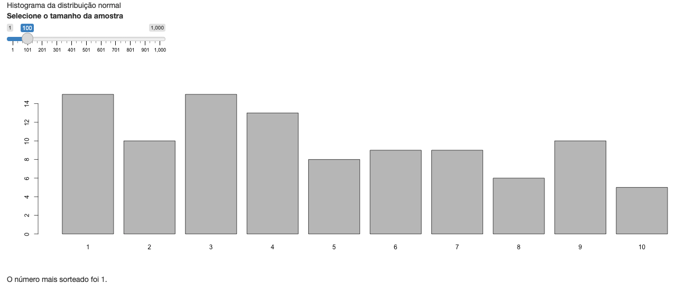

```{r, echo = FALSE}
knitr::opts_chunk$set(
  fig.align = "center"
)
```

# Reatividade: conceitos básicos

Imagine que gostaríamos de criar um app que geresse um gráfico com o resultado do sorteio de uma amostra de números entre 1 e 10 e que o tamanho dessa amostra fosse definido por um input. Além disso, que esse app também indicasse em texto qual foi o número mais sorteado. 

Pensando na construção desse app, teríamos um input, o tamanho da amostra, e dois outputs, um gráfico (de barras) indicando a frequência de cada número e um texto dizendo qual o número mais sorteado. Pelo que aprendemos no capítulo anterior, podemos usar um `sliderInput()` para receber o tamanho da amostra e as funções `renderPlot()` e `renderText()` para construir os textos. No entanto, uma dúvida emerge com relação ao sorteio da amostra: onde ele deve ser feito?

Obviamente, sortear a amostra durante a construção de cada output como exemplifica o código abaixo não vai funcionar pois geraríamos duas amostras diferentes^[Claro que poderíamos usar a função `set.seed()` para garantir que as amostras fossem as mesmas, mas imagine que não queremos escolher uma semente para a geração dos dados ou que, em algum outro contexto, o processo de amostragem fosse demorado e não queremos fazê-lo duas vezes.]. 

```{r}
# Solução insuficiente, pois as amostras geradas serão diferentes
server <- function(input, output, session) {
  
  output$grafico <- renderPlot({
    amostra <- sample(1:10, input$tamanho, replace = TRUE)
    amostra |> 
      table() |> 
      barplot()
  })
    
  output$resultado <- renderText({
    amostra <- sample(1:10, input$tamanho, replace = TRUE)
    contagem <- table(amostra)
    mais_freq <- names(contagem[which.max(contagem)])
    glue::glue("O valor mais sorteado foi o {mais_freq}.")
  })
}
```

A solução ingênua seria criar a amostra uma única vez, fora das funções `render*()`, mas isso retornará um erro. O que a mensagem de erro diz, de maneira mais direta, é que essa solução fere as regras de reatividade do Shiny.

```{r}
# Solução incorreta, pois viola as regras de reatividade do Shiny.
server <- function(input, output, session) {
  
  amostra <- sample(1:10, input$tamanho, replace = TRUE)
  
  output$grafico <- renderPlot({
    amostra |> 
      table() |> 
      barplot()
  })
    
  output$resultado <- renderText({
    contagem <- table(amostra)
    mais_freq <- names(contagem[which.max(contagem)])
    glue::glue("O valor mais sorteado foi o {mais_freq}.")
  })
}

#> Error in : Can't access reactive value 'tamanho' outside of reactive consumer.
```

A construção desse app traz à tona a necessidade de uma nova peça do Shiny, que não mencionamos ainda. Sem ela não consiguiríamos criar esse app de maneira eficiente. 

No entanto, como podemos ver pela mensagem de erro da tentiva anterior, para ficar clara a importância dessa nova peça precisamos falar de um dos temas centrais do desenvolvimento de aplicativos Shiny: a reatividade.

Na próxima seção, faremos uma breve introdução explicando o que é reatividade e por que ela é importante no Shiny. Em seguida, falaremos sobre as peças fundamentais da reatividade (duas delas já conhecemos, apresentaremos a faltante). Por fim, vamos conhecer o `reactlog`, uma ferramente muito útil para visualizar a reatividade de um aplicativo.

## O que é reatividade?

Quando escrevemos código R, dois paradigmas estão sempre presentes:

- podemos avaliar uma linha de código assim que a escrevermos; e

- se decidirmos rodar todo o script de uma vez, as linhas de código serão avaliadas sequencialmente.

Isso faz com que as nossas tarefas de análise de dados geralmente virem scripts sequenciais, cujo código não pode ser executado fora de ordem.

O código abaixo, que executa a corriqueira tarefa de importar, manipular e visualizar uma base, mostra um exemplo disso. Construímos o código rodando linha a linha, para testar se estamos seguindo pelo caminho certo. Ao final, podemos rodar tudo de uma vez para obter o resultado desejado (o gráfico). Se o código for rodado fora de ordem, nada vai funcionar.

```{r, eval = FALSE}
tab_starwars <- dplyr::starwars

tab_grafico <- tab_starwars |>
  tidyr::unnest(films) |> 
  tidyr::drop_na(species) |> 
  dplyr::group_by(films) |>
  dplyr::summarise(total_especies = dplyr::n_distinct(species)) |> 
  dplyr::mutate(
    films = forcats::fct_reorder(films, total_especies)
  )

tab_grafico |> 
  ggplot2::ggplot(ggplot2::aes(y = films, x = total_especies)) +
  ggplot2::geom_col() +
  ggplot2::theme_minimal() +
  ggplot2::labs(x = "Total de espécies", y = "Filme")
```

A reatividade é um outro paradigma de programação. Com ela, não construímos códigos que serão rodados interativamente ou sequencialmente. A ideia da programação reativa é **especificar um fluxo de reatividade**, isto é, um diagrama de dependências que será utilizado para definir o que deve ser executado e quando. No contexto do Shiny, o fluxo de reatividade é quem decide quais outputs devem ser recalculados quando um input muda.

Dominar o conceito de reatividade nos permite construir apps mais eficientes e sofisticados. Mais do que isso, nos permite evitar cada vez mais os erros visíveis  --- como o apresentado na introdução do capítulo --- e invisíveis --- quando o app funciona, mas de maneira ineficiente ---, que nos consomem um bom tempo na hora do desenvolvimento. Dominar o conceito de reatividade nos faz melhor em Shiny, e garanto que vale a pena traçar esse caminho desde o início.

O primeiro passo é entender o que é o fluxo de reatividade. 

## O fluxo de reatividade

Faremos isso conhecendo as suas 3 peças fundamentais: os valores reativos, os *observers* e as expressões reativas. Elas serão os temas das próximas secões.

### Valores reativos

Os valores reativos são **a origem do fluxo reativo**. Eles guardam as informações que vêm da UI e disparam um *sinal de alerta* sempre que essas informações mudam. Esse sinal é enviado a qualquer output do app que dependa desses valores e indica que essas saídas devem ser recalculadas.

Embora não tenhamos os apresentas dessa forma, nós já usamos valores reativos em exemplos anteriores. Nos referimos aos inputs, ou melhor, aos valores dentro da lista `input`, na função `server`. Eles são os valores reativos mais comuns, pois estarão presentes em qualquer app. 

### *Observers*

O *sinal de alerta* enviado por um valor reativo sempre que ele sofre uma mudança é o início do fluxo reativo. O fluxo tem sequência com os *observers*, que recebem e interpretam esse sinal. Como resultado, os *observers* buscam o valor atualizado do valor reativo e recalculam as suas saídas, dando fim ao fluxo.

Os *observers* mais comuns, também já utilizados anteriormente, são as funções `render*()`. Elas guardam os códigos que geram os outputs do app, que na maioria dos casos dependem dos valores reativos. Assim, além de renderizar seus conteúdos para HTML, essas funções têm o papel de escutar os sinais de alerta gerados pelos valores reativos, para que os outputs sejam recalculados quando os inputs mudam.

### Expressões reativas

Muitas vezes, um aplicativo shiny precisa de passos intermediários, entre o input de origem e o output final. Isto é, precisamos de uma estrutura que receba um valor reativo, faça alguma conta e devolva um resultado, um valor também reativo que será utilizado posteriormente em um *observer*. Essas estruturas são as **expressões reativas**. Elas são nossa peça faltante.

### O fluxo em detalhes

## As funções `reactive` e `eventReactive`

Keep in mind that if your application tries to access reactive values or expressions from outside a reactive context — that is, outside of a reactive expression or observer — then it will result in an error. You can think of there being a reactive “world” which can see and change the non-reactive world, but the non-reactive world can’t do the same to the reactive world. Code like this will not work, because the call to fib() is not in the reactive world (it’s not in a reactive() or renderXX() call) but it tries to access something that is, the reactive value input$n:

```{r, eval = FALSE}
server <- function(input, output) {
  # Will give error
  currentFib      <- fib(as.numeric(input$n))
  output$nthValue <- renderText({ currentFib })
}
```

Imagine um app que gere uma amostra de números aleatórios entre 1 e 10 e que o tamanho dessa amostra é definido por um input. Além disso, esse app também indique em texto qual foi o número mais sorteado. A figura a seguir mostra uma implementação desse app.

```{r, out.width=10, echo = FALSE}

```

Repare no código do app, apresentado a seguir, que a criação da amostra não poderia ter sido feita diretamente dentro das funções `renderPlot()` e `renderText()`, pois gerariam amostras diferentes. Por outro lado, a geração da amostra precisa estar dentro de um contexto reativo, pois ela utiliza um valor reativo (`input$num`), o que tira da mesa a proposta de fazer isso diretamente dentro da função `server`.

```{r, eval=FALSE}
library(shiny)

ui <- fluidPage(
  "Histograma da distribuição normal",
  sliderInput(
    inputId = "num",
    label = "Selecione o tamanho da amostra",
    min = 1,
    max = 1000,
    value = 100
  ),
  plotOutput(outputId = "hist"),
  textOutput(outputId = "media")
)

server <- function(input, output, session) {

  amostra <- reactive({
    sample(1:10, input$num, replace = TRUE)
  })

  output$hist <- renderPlot({
    barplot(table(amostra()))
  })

  output$media <- renderText({
    contagem <- sort(table(amostra()), decreasing = TRUE)
    mais_frequente <- names(contagem[1])
    glue::glue("O número mais sorteado foi {mais_frequente}.")
  })

}

shinyApp(ui, server)

```

A solução nesse caso foi utilizar a função `reactive()`. Essa função cria a expressão reativa `amostra`, que é utilizada dentro das funções `renderPlot()` e `renderText()` para obtermos a amostra sorteada. Note que, para retornar o valor de uma expressão reativa, devemos chamá-la como se fosse uma função, abrindo e fechando parênteses após o nome: `amostra()`.

Nesse exemplo, o `input$num` é um valor reativo, a `amostra()` é uma expressão reativa e as funções `renderPlot()` e `renderText()` são *observers*. O fluxo reativo se inicia com um mudança no valor do `input$num` e termina com a recriação do gráfico e do texto. O valor reativo, quando alterado, avisa à expressão reativa `amostra` que seu valor está desatualizado e, por sua vez, a `amostra` avisa aos *observers* `renderPlot()` e `renderText()` que seu valor está desatualizado. Assim, tanto a expressão reativa quanto os *observers* são recalculados e seus resultados enviado de volta para a UI.

Se esses conceitos apresentados até agora estão muito abstratos, pense em uma fábrica de brinquedos. A fábrica utiliza algumas matérias-primas, como madeira, plástico e tecido, para fabricar os brinquetos. Nela, existem algumas máquinas que recebem a matéria-prima e a transformam em partes dos brinquedos, assim como máquinas que recebem tanto matérias-prima quanto essas partes pré-fabricadas e montam o brinquedo.

Nessa metáfora, a matéria-prima representa os valores reativos (cada material pode ser visto como um input), as máquinas que produzem as partes são as expressões reativas e a máquina que monta o brinquedo são os *observers*.

Nas próxima seções, falaremos com mais detalhes de cada uma dessas estruturas e das funções que utilizamos para criá-las.

## Diagrama de reatividade: `reaclog`

O maior desafio no desenvolvimento de um Shiny app é a construção do fluxo de reatividade. Além de a reatividade ser um conceito abstrato e invisível no código, precisamos não apenas garantir que o app funcione, mas também que funcione adequadamente.

Se ao mudar o valor de um *slider*, esperamos que um gráfico seja atualizado, dois problemas podem surgir: (1) o gráfico não ser recalculado e (2) o gráfico ser recalculado mais de uma vez.

Os dois problemas indicam um fluxo de reatividade mal construído. A diferença é que, enquanto no primeiro caso o app não funciona, no segundo, ignorando-se o comportamento estranho, ele entrega o que se espera dele.

Para evitar esses problemas (que discutiremos em detalhes no Capítulo \@ref(reatividade2)), podemos imaginar ou desenhar o fluxo de reatividade para investigar onde está a falha. Essa é uma tarefa simples em apps com poucos inputs e outputs, mas extremamente difícil ou inviável em apps complexos.

Nesses casos, ou mesmo nos casos simples, podemos utilizar o pacote `reactlog`. Com ele, além de desenharmos facilmente um diagrama de dependências reativas de qualquer Shiny app, podemos olhar o que acontece por trás das curtinas da reatividade quando executamos o aplicativo.

Antes de mais nada, instale o pacote `reactlog`.

```{r, eval = FALSE}
install.packages("reactlog")
```

Em seguida, no Console, rode o código abaixo. Isso vai habilitar o `reactlog` para qualquer app que você rodar na sessão de R atual.

```{r, eval=FALSE}
options(shiny.reactlog = TRUE) 
```

Por fim, rode o seu app e utilize o comando `CTRL + F3` (no Mac, `command + F3`). O seu navegador abrirá uma nova aba com o diagrama de reatividade. Veja o exemplo a seguir. Primeiro temos a UI de um aplicativo que gera o histograma de uma amostra com distribuição normal. O tamanho da amostra é determinado pelo sliderInput. Sempre qua o tamanho da amostra muda, o gráfico é recalculado.


```{r, echo = FALSE, fig.cap="Shiny app que mostra o histograma de uma amostra com distribuição normal. O tamanho da amostra é determinado por um sliderInput.", fig.alt = "Shiny app que mostra o histograma de uma amostra com distribuição normal. O tamanho da amostra é determinado por um sliderInput."}
knitr::include_graphics("img/app_hist_normal.png")
```

Veja agora o diagrama de reatividade associado a esse app. A forma dos 4 elementos mais a esquerda representa inputs ou valores reativos, a forma do elemento `plotObj` representa expressões reativas e a forma do elemento `output$hist` representa os outputs (ou observadores).

```{r, echo = FALSE, fig.cap="Diagrama de reatividade do app anterior.", fig.alt = "Diagrama de reatividade do app anterior criado pelo pacote reactlog."}
knitr::include_graphics("img/reaclog_diagrama_completo.png")
```

Parece muito mais complicado do que deveria, né? Acontece que além do input e output, o diagrama também apresenta elementos referentes ao tamanho da janela da pessoa que está utilizando o app. Esses elementos influenciam na imagem produzida para o gráfico dentro do HTML, que é redimensionada a depender do tamanho da tela. Por isso a existência do elemento intermediário `plotObj`, que guarda as instruções para gerar o gráfico criadas pelo código R. Assim, o código R no servidor não precisa ser rodado novamente para que a imagem do gráfico seja redimensionada.

Podemos filtrar o diagrama para mostrar apenas o fluxo relacionado aos inputs do aplicativo escrevendo `input` no campo de busca. Repare também que os comandos no canto superior esquerdo permitem visualizar o fluxo de reatividade das ações realizadas entre a inicialização do app e o momento em que criamos o diagrama (quando pressionamos CTRL + F3).

```{r, echo = FALSE, fig.cap="Diagrama de reatividade do app anterior.", fig.alt = "Diagrama de reatividade do app anterior criado pelo pacote reactlog."}
knitr::include_graphics("img/reactlog_comandos.png")
```

Em resumo, com um diagrama de reatividade em mãos, podemos:

- ver os inputs dos quais cada output depende e não depende;

- investigar porque o código de um output não é rodado ou roda duas vezes quando acionamos um input do qual ele deveria depender;

- ter uma visão menos abstrada do fluxo de reatividade e entender melhor o que acontece quando executamos cada parte do nosso app.

Embora o exemplo apresentado tenha um fluxo reativo bem simples, utilize o código a seguir para reproduzir o app. Mexa algumas vezes no *slider* e acesse o driagrama de reatividade. Tente usar os controles de navegação para visualizar cada etapa do ciclo reativo. Ao longo deste capítulo, apresentaremos alguns diagramas mais complexos.

```{r, eval = FALSE}
library(shiny)

ui <- fluidPage(
  "Histograma da distribuição normal",
  sliderInput(
    inputId = "num",
    label = "Selecione o tamanho da amostra",
    min = 1,
    max = 1000,
    value = 100
  ),
  plotOutput(outputId = "hist")
)

server <- function(input, output, session) {

  output$hist <- renderPlot({
    amostra <- rnorm(input$num)
    hist(amostra)
  })

}

shinyApp(ui, server)

```

Como descrito na [documentação da ferramenta](https://shiny.rstudio.com/reference/shiny/0.14/showReactLog.html), por razões de segurança e performance, nunca habilite o `reaclog` em ambientes de produção. Quando ele está habilitado, qualquer pessoal utilizando o seu app pode ver pelo menos parte do seu código fonte (que eventualmente pode conter informações sensíveis).

Você pode aprender mais sobre o funcionamento do `reaclog` [clicando aqui](https://rstudio.github.io/reactlog/articles/reactlog.html). 

