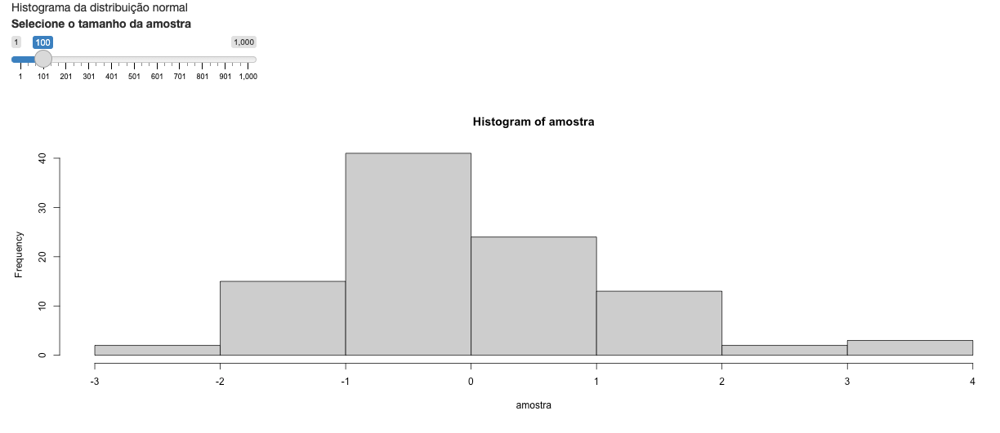
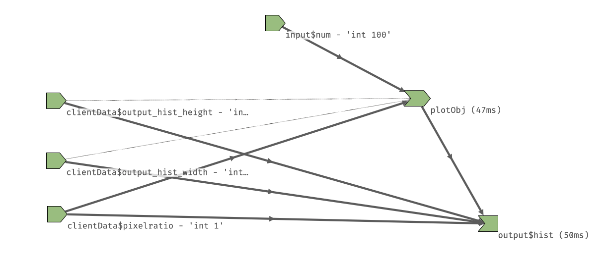
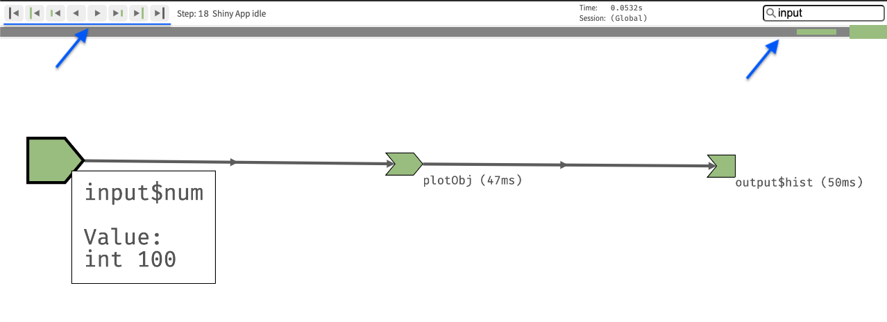

```{r, echo = FALSE}
knitr::opts_chunk$set(
  fig.align = "center"
)
```

# Reatividade: conceitos básicos

Neste capítulo, falaremos de um tema central para quem deseja construir aplicativos em Shiny: a reatividade.

Primeiro, faremos uma breve introdução explicando o que é reatividade e por que ela é importante no Shiny. Em seguida, falaremos sobre valores e expressões reativdas, isto é, como a reatividade se manifesta dentro dos nossos códigos. As demais seções desse capítulo vão nos ensinar como construir diversos fluxos básicos de reatividade corretamente.

## O que é reatividade?

Antes de mais nada, é válido ressaltar que não precisamos entender o que é reatividade e como ela funciona para usá-la e construir um aplicativo Shiny. Nos capítulos anteriores, construímos alguns aplicativos sem falar explicitamente de reatividade.

Uma pessoa iniciante no Shiny pode decorar como utilizar os valores e expressões reativas e desenvolver diversos tipos de app sem nunca entender como a reatividade funciona. Eu não recomendo esse caminho. 

Dominar o conceito de reatividade nos permite construir apps mais eficientes e sofisticados. Mais do que isso, nos permite evitar cada vez mais os erros de mau uso dos valores e expressões reativas, que nos consomem um bom tempo do dia-a-dia de desenvolvimento. Dominar o conceito de reatividade nos faz melhor em Shiny, e garanto que vale a pena traçar esse caminho desde o início.

https://shiny.rstudio.com/articles/understanding-reactivity.html

## Valores e funções reativas

## Diagrama de reatividade: `reaclog`

O maior desafio no desenvolvimento de um Shiny app é a construção do fluxo de reatividade. Além de a reatividade ser um conceito abstrato e invisível no código, precisamos não apenas garantir que o app funcione, mas também que funcione adequadamente.

Se ao mudar o valor de um *slider*, esperamos que um gráfico seja atualizado, dois problemas podem surgir: (1) o gráfico não ser recalculado e (2) o gráfico ser recalculado mais de uma vez.

Os dois problemas indicam um fluxo de reatividade mal construído. A diferença é que, enquanto no primeiro caso o app não funciona, no segundo, ignorando-se o comportamento estranho, ele entrega o que se espera dele.

Para evitar esses problemas (que discutiremos em detalhes no Capítulo \@ref(reatividade2)), podemos imaginar ou desenhar o fluxo de reatividade para investigar onde está a falha. Essa é uma tarefa simples em apps com poucos inputs e outputs, mas extremamente difícil ou inviável em apps complexos.

Nesses casos, ou mesmo nos casos simples, podemos utilizar o pacote `reactlog`. Com ele, além de desenharmos facilmente um diagrama de dependências reativas de qualquer Shiny app, podemos olhar o que acontece por trás das curtinas da reatividade quando executamos o aplicativo.

Antes de mais nada, instale o pacote `reactlog`.

```{r, eval = FALSE}
install.packages("reactlog")
```

Em seguida, no Console, rode o código abaixo. Isso vai habilitar o `reactlog` para qualquer app que você rodar na sessão de R atual.

```{r, eval=FALSE}
options(shiny.reactlog = TRUE) 
```

Por fim, rode o seu app e utilize o comando `CTRL + F3` (no Mac, `command + F3`). O seu navegador abrirá uma nova aba com o diagrama de reatividade. Veja o exemplo a seguir. Primeiro temos a UI de um aplicativo que gera o histograma de uma amostra com distribuição normal. O tamanho da amostra é determinado pelo sliderInput. Sempre qua o tamanho da amostra muda, o gráfico é recalculado.


```{r, echo = FALSE, fig.cap="Shiny app que mostra o histograma de uma amostra com distribuição normal. O tamanho da amostra é determinado por um sliderInput.", fig.alt = "Shiny app que mostra o histograma de uma amostra com distribuição normal. O tamanho da amostra é determinado por um sliderInput."}

```

Veja agora o diagrama de reatividade associado a esse app. A forma dos 4 elementos mais a esquerda representa inputs ou valores reativos, a forma do elemento `plotObj` representa expressões reativas e a forma do elemento `output$hist` representa os outputs (ou observadores).

```{r, echo = FALSE, fig.cap="Diagrama de reatividade do app anterior.", fig.alt = "Diagrama de reatividade do app anterior criado pelo pacote reactlog."}

```

Parece muito mais complicado do que deveria, né? Acontece que além do input e output, o diagrama também apresenta elementos referentes ao tamanho da janela da pessoa que está utilizando o app. Esses elementos influenciam na imagem produzida para o gráfico dentro do HTML, que é redimensionada a depender do tamanho da tela. Por isso a existência do elemento intermediário `plotObj`, que guarda as instruções para gerar o gráfico criadas pelo código R. Assim, o código R no servidor não precisa ser rodado novamente para que a imagem do gráfico seja redimensionada.

Podemos filtrar o diagrama para mostrar apenas o fluxo relacionado aos inputs do aplicativo escrevendo `input` no campo de busca. Repare também que os comandos no canto superior esquerdo permitem visualizar o fluxo de reatividade das ações realizadas entre a inicialização do app e o momento em que criamos o diagrama (quando pressionamos CTRL + F3).

```{r, echo = FALSE, fig.cap="Diagrama de reatividade do app anterior.", fig.alt = "Diagrama de reatividade do app anterior criado pelo pacote reactlog."}

```

Em resumo, com um diagrama de reatividade em mãos, podemos:

- ver os inputs dos quais cada output depende e não depende;

- investigar porque o código de um output não é rodado ou roda duas vezes quando acionamos um input do qual ele deveria depender;

- ter uma visão menos abstrada do fluxo de reatividade e entender melhor o que acontece quando executamos cada parte do nosso app.

Embora o exemplo apresentado tenha um fluxo reativo bem simples, utilize o código a seguir para reproduzir o app. Mexa algumas vezes no *slider* e acesse o driagrama de reatividade. Tente usar os controles de navegação para visualizar cada etapa do ciclo reativo. Ao longo deste capítulo, apresentaremos alguns diagramas mais complexos.

```{r, eval = FALSE}
library(shiny)

ui <- fluidPage(
  "Histograma da distribuição normal",
  sliderInput(
    inputId = "num",
    label = "Selecione o tamanho da amostra",
    min = 1,
    max = 1000,
    value = 100
  ),
  plotOutput(outputId = "hist")
)

server <- function(input, output, session) {

  output$hist <- renderPlot({
    amostra <- rnorm(input$num)
    hist(amostra)
  })

}

shinyApp(ui, server)

```

Como descrito na [documentação da ferramenta](https://shiny.rstudio.com/reference/shiny/0.14/showReactLog.html), por razões de segurança e performance, nunca habilite o `reaclog` em ambientes de produção. Quando ele está habilitado, qualquer pessoal utilizando o seu app pode ver pelo menos parte do seu código fonte (que eventualmente pode conter informações sensíveis).

Você pode aprender mais sobre o funcionamento do `reaclog` [clicando aqui](https://rstudio.github.io/reactlog/articles/reactlog.html). 

## Funções `render`

## `reactive` e `eventReactive`

## `observe` e `observEvent`

## Importando bases de dados
