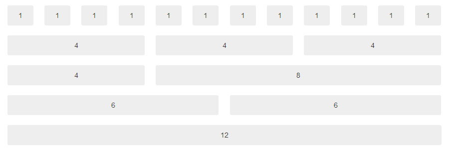
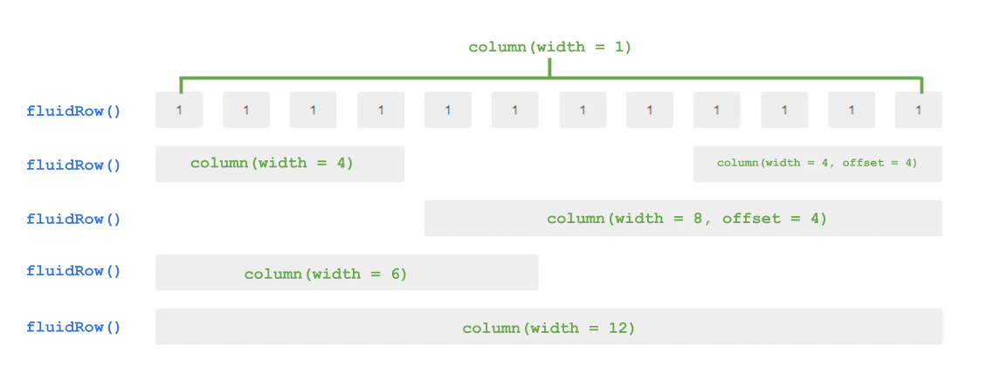
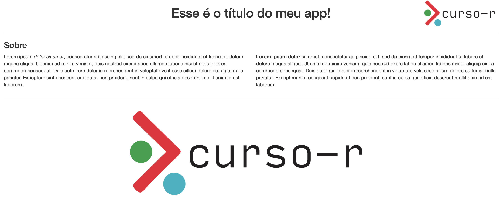

```{r, echo = FALSE}
knitr::opts_chunk$set(
  fig.align = "center"
)
```

# UI e Layouts {#layouts}

## Um pouco sobre HTML

HTML é uma [linguagem de marcação](https://pt.wikipedia.org/wiki/Linguagem_de_marca%C3%A7%C3%A3o) para construir páginas web. 

Uma linguagem de marcação é apenas um tipo de documento que contem texto simples (como em um bloco de notas) e um conjunto de instruções para formatar (anotar, marcar) parte específicas do conteúdo. Além do HTML, o LaTeX e o (R) Markdown são outros exemplos comuns de linguagem de marcação.

A maior parte do esforço em aprender uma linguagem de marcação está em aprender quais são e como utilizar as instruções de formatação.

No HTML, as instrução de formatação são chamadas *tags*. Utilizaremos as *tags* para formatar o texto da página web que estamos criando. Com elas, podemos, por exemplo, transformar um texto em negrito ou itálico, criar títulos e inserir imagens. 

O pacote `shiny` traz diversas funções que simulam essas tags. As principais são:

```{r, echo = FALSE}
tibble::tribble(
  ~`função`, ~`para que serve`,
  "a()", "cria um hiperlink",
  "hr()", "cria uma linha horizontal",
  "br()", "insere uma quebra de linha",
  "h1(), ..., h6()", "cria títulos",
  "img()", "insere uma imagem",
  "p()", "cria um parágrafo",
  "em()", "formata o texto em itálico",
  "strong()", "formata o texto em negrito"
) |> 
  reactable::reactable(
    sortable = FALSE
  )
```

Podemos utilizar essas funções à vontade na UI para construirmos o layout do nosso app. O código abaixo, por exemplo, gera o código HTML a seguir.

```{r, eval = FALSE}
#ui
fluidPage(
  h1("Esse é o título do meu app!", align = "center"),
  hr(),
  h3("Sobre"),
  p("Lorem ipsum", tags$em("dolor sit amet", .noWS = "after"), ", consectetur adipiscing elit, sed do eiusmod tempor incididunt ut labore et dolore magna aliqua. Ut enim ad minim veniam, quis nostrud exercitation ullamco laboris nisi ut aliquip ex ea commodo consequat. Duis aute irure dolor in reprehenderit in voluptate velit esse cillum dolore eu fugiat nulla pariatur. Excepteur sint occaecat cupidatat non proident, sunt in culpa qui officia deserunt mollit anim id est laborum."),
  p(strong("Lorem ipsum dolor"), "sit amet, consectetur adipiscing elit, sed do eiusmod tempor incididunt ut labore et dolore magna aliqua. Ut enim ad minim veniam, quis nostrud exercitation ullamco laboris nisi ut aliquip ex ea commodo consequat. Duis aute irure dolor in reprehenderit in voluptate velit esse cillum dolore eu fugiat nulla pariatur. Excepteur sint occaecat cupidatat non proident, sunt in culpa qui officia deserunt mollit anim id est laborum."),
  hr(),
  img(src = "img/logo.png", width = "50%", style = "display: block; margin: auto;")
)
```

```{html}
<div class="container-fluid">
  <h1 align="center">Esse é o título do meu app!</h1>
  <hr/>
  <h3>Sobre</h3>
  <p>
    Lorem ipsum
    <em>dolor sit amet</em>, consectetur adipiscing elit, sed do eiusmod tempor incididunt ut labore et dolore magna aliqua. Ut enim ad minim veniam, quis nostrud exercitation ullamco laboris nisi ut aliquip ex ea commodo consequat. Duis aute irure dolor in reprehenderit in voluptate velit esse cillum dolore eu fugiat nulla pariatur. Excepteur sint occaecat cupidatat non proident, sunt in culpa qui officia deserunt mollit anim id est laborum.
  </p>
  <p>
    <strong>Lorem ipsum dolor</strong>
    sit amet, consectetur adipiscing elit, sed do eiusmod tempor incididunt ut labore et dolore magna aliqua. Ut enim ad minim veniam, quis nostrud exercitation ullamco laboris nisi ut aliquip ex ea commodo consequat. Duis aute irure dolor in reprehenderit in voluptate velit esse cillum dolore eu fugiat nulla pariatur. Excepteur sint occaecat cupidatat non proident, sunt in culpa qui officia deserunt mollit anim id est laborum.
  </p>
  <hr/>
  
</div>
```

Que, por sua vez, gera a UI a seguir:

```{r, echo = FALSE, results='asis'}
library(shiny)
#ui
fluidPage(
  h1("Esse é o título do meu app!", align = "center"),
  hr(),
  h3("Sobre"),
  p("Lorem ipsum", tags$em("dolor sit amet", .noWS = "after"), ", consectetur adipiscing elit, sed do eiusmod tempor incididunt ut labore et dolore magna aliqua. Ut enim ad minim veniam, quis nostrud exercitation ullamco laboris nisi ut aliquip ex ea commodo consequat. Duis aute irure dolor in reprehenderit in voluptate velit esse cillum dolore eu fugiat nulla pariatur. Excepteur sint occaecat cupidatat non proident, sunt in culpa qui officia deserunt mollit anim id est laborum."),
  p(strong("Lorem ipsum dolor"), "sit amet, consectetur adipiscing elit, sed do eiusmod tempor incididunt ut labore et dolore magna aliqua. Ut enim ad minim veniam, quis nostrud exercitation ullamco laboris nisi ut aliquip ex ea commodo consequat. Duis aute irure dolor in reprehenderit in voluptate velit esse cillum dolore eu fugiat nulla pariatur. Excepteur sint occaecat cupidatat non proident, sunt in culpa qui officia deserunt mollit anim id est laborum."),
  hr(),
  img(src = "img/logo.png", width = "50%", style = "display: block; margin: auto;")
)
```

<br>
<br>

Repare que algumas tags, como a `h1` e a `img` possuem parâmetros. O parâmetro `align` na tag `h1` faz com que o texto fique alinhado no centro da página. Esse parâmetro é típico das tags de título (`h1`, ..., `h6`). Outras tags de texto, como a tag `p` por exemplo, não possuem necessariamente esse argumento. 

Já o argumento `src` da tag `img` é utilizado para definirmos o caminho para a imagem que queremos mostra. O argumento `width` especifica o comprimento da imagem com relação ao espaço disponível para a imagem. Nesse caso, isso quer dizer que o logo da Curso-R ocupa 90% do comprimento da página deste livro. O argumento `style` nos permite formatar ainda mais a imagem a partir de atributos CSS.

Conforme aprendemos e utilizamos o Shiny, inevitavelmente aprendemos bastante sobre HTML. Isso aumenta bastante a nossa capacidade de personalizar as UIs dos nossos aplicativos e nos ajuda a entender como o Shiny funciona. Por enquanto, vamos manter o foco em explorar as principais ferramentas do Shiny, mas no Capítulo \@ref(alem) faremos uma breve introdução formal tanto de HTML quanto de CSS. 

## Bootstrap

Hoje em dia, uma página Web pode ser vista em dispositivos de diferentes tamanhos (celulares, tablets, notebooks, televisões...) e o layout da página deve se adaptar à enorme variedade de tamanho de telas. Isso é um grande desafio para quem desenvolve.

Uma solução seria produzir uma versão para telas pequenas e uma versão para telas grandes, direcionando as visitas para a versão adequada a depender do dispositivo utilizado. Muitos sites utilizam essa alternativa, e você pode verificar isso pela URL. Páginas próprias para dispositivos *mobile* possuem um `m.` no início da URL.

Nem sempre essa alternativa é viável, pois produzir duas versões de uma página ou aplicação Web pode ser muito custoso. Nesses casos, a solução é produzir um layout *responsivo*, isto é, que se adapte a depender do tamanho da tela. E aí que entra o **Bootstrap**.

O [Bootstrap Framework](https://getbootstrap.com.br/docs/4.1/getting-started/introduction/) é uma coleção de códigos CSS que nos ajudam a construir páginas Web *responsíveis*. Boa parte da internet hoje em dia é construída em cima do Bootstrap, e nossos aplicativos Shiny não serão diferentes.

O Shiny importa a versão 3 do Bootstrap, o quer dizer que podemos utilizar todo o ferramental desse framework em nossos apps. Se você não sabe CSS, não tem problema. Podemos aproveitar todo o poder do Bootstrap dentro do Shiny apenas aprendendo a usar algumas funções de R.

Antes de vermos essas funções, precisamos entender como funciona o *grid system*. O Bootstrap estabelece que:

1. os elementos em uma página serão dispostos primeiramente em linhas;

2. cada nova linha será colocada embaixo da anterior;

3. cada linha pode ser dividida em até 12 colunas; independentemente do tamanho da tela.

4. cada coluna pode ter até 12 unidades de comprimento, sendo que a soma dos comprimentos das colunas de uma linha deve ser no máximo 12.

5. quando a tela for pequena o suficiente^[Você pode conferir os tamanhos limites na documentação do Bootstrap: https://getbootstrap.com.br/docs/4.1/getting-started/introduction/)] todas as colunas passam a ter comprimento 12.

Em resumo, isso significa que, quando estivermos em telas pequenas, todos os elementos que hora estavam lado a lado, passam a ficar um embaixo do outro.

```{r, out.width="100%", echo = FALSE}

```

Em resumo, o conceito por trás do Boostrap estabelece que o layout dos nossos apps serão formados por linhas com até 12 colunas cada. O comprimento de cada coluna pode variar de 1 a 12 unidades.

No Shiny, para criar novas linhas, utilizamos a função `fluidRow()`. 

Para criar colunas dentro de uma linha, utilizamos a função `column()`. Essa função tem dois argumentos: `width` e `offset`. O primeiro determina o comprimento da coluna (de 1 a 12). O segundo indica quanto espaço horizontal gostaríamos de "pular" antes de começar a nossa coluna. A função `column()` é sempre utilizada dentro da função `fluidRow()`.

Seguindo esse esquema, passamos a colocar o conteúdo da página dentro das colunas, isto é, dentro da função `column()`.

```{r, echo = FALSE, out.width="100%"}

```

Utilizando essas funções, podemos mudar o exemplo da seção anterior da seguinte maneira:

```{r, results='asis', eval = FALSE}
library(shiny)
#ui
fluidPage(
  fluidRow(
    column(
      width = 8,
      offset = 2,
      h1("Esse é o título do meu app!", align = "center")
    ),
    column(
      width = 2,
      img(src = "img/logo.png", width = "100%")
    )
  ),
  hr(),
  h3("Sobre"),
  fluidRow(
    column(
      width = 6,
      p("Lorem ipsum", tags$em("dolor sit amet", .noWS = "after"), ", consectetur adipiscing elit, sed do eiusmod tempor incididunt ut labore et dolore magna aliqua. Ut enim ad minim veniam, quis nostrud exercitation ullamco laboris nisi ut aliquip ex ea commodo consequat. Duis aute irure dolor in reprehenderit in voluptate velit esse cillum dolore eu fugiat nulla pariatur. Excepteur sint occaecat cupidatat non proident, sunt in culpa qui officia deserunt mollit anim id est laborum.")
    ),
    column(
      width = 6,
      p(strong("Lorem ipsum dolor"), "sit amet, consectetur adipiscing elit, sed do eiusmod tempor incididunt ut labore et dolore magna aliqua. Ut enim ad minim veniam, quis nostrud exercitation ullamco laboris nisi ut aliquip ex ea commodo consequat. Duis aute irure dolor in reprehenderit in voluptate velit esse cillum dolore eu fugiat nulla pariatur. Excepteur sint occaecat cupidatat non proident, sunt in culpa qui officia deserunt mollit anim id est laborum.")
    )
  ),
  hr(),
  fluidRow(
    column(
      width = 6,
      offset = 3,
      img(src = "img/logo.png", width = "100%")
    )
  )
)
```

```{r, echo = FALSE}

```

<br>
<br>

Repare que agora a imagem no inferior da página foi centralizada utilizando as funções `fluidRow()` e `column()`. Não foi mais necessário definir CSS diretamente para realizar essa tarefa. Como exercício, construa um app com a UI do código anterior e veja o que acontece com a página conforme você diminui o comprimento da tela.

## Layouts prontos

### `sidebarLayout()`

### `navbarPage()`

## Dashboards

### `shinydashboard`

### `bs4Dash`

## Um pouco sobre CSS

## Usando Markdown para textos

É comum precisarmos colocar em nossos aplicativos páginas com orientações, informações adicionais ou referências. 

Essas páginas geralmente são compostas por textos, links e imagens, facilmente produzidos em um arquivo Markdown. Em contrapartida, construir esses elementos dentro da UI dá bem mais trabalho, pois tudo precisa ser encapsulado por uma função da lista `shiny::tags$`.

Por exemplo, vamos supor que eu queria colocar a minha *mini bio* (a seguir) em um app que estou fazendo.

<br>

<center>


**William Amorim**

Doutor em Estatística pelo IME-USP. Trabalhando diaramente com análise de dados, programação em R e criação de dashboards. Falo sobre Shiny no [Twitter](https://twitter.com/wamorim_).
</center>

<br>
<br>

O arquivo Markdown para construir essa mini bio seria bem simples:

```
<center>


**William Amorim**

Doutor em Estatística pelo IME-USP. Trabalhando diaramente com análise de dados, programação em R e criação de dashboards. Falo sobre Shiny no [Twitter](https://twitter.com/wamorim_).
</center>
```

A mesma mini bio na UI, já é bem mais chato de construir e manter.

```{r, eval = FALSE}
fluidPage(
  fluidRow(
    column(
      width = 12,
      shiny::tags$img(
        src = "img/foto_william.jpg",
        width = "130px",
        style = "border-radius: 65px; display: block; margin: auto;"
      ),
      shiny::tags$p(
        shiny::tags$strong("William Amorim"),
        style = "text-align: center;"
      ),
      shiny::tags$p(
        style = "text-align: center;",
        "Doutor em Estatística pelo IME-USP. Trabalhando diaramente 
        com análise de dados, programação em R e criação de dashboards.
        Falo sobre Shiny no",
        shiny::tags$a(
          href = "https://twitter.com/wamorim_",
          "Twitter."
        )
      )
    )
  )
)
```

Mesmo um exemplo simples já começa a deixar claro o problema: produzir muitos elementos HTML na UI rapidamente transforma seu código em um emaranhado de funções aninhadas e cheias de texto. O mesmo vale para textos muito grandes. Embora nesse caso nem sempre tenhámos muitas tags HTML para criar, scripts R não foram feitos para atender os cuiddos que textos carecem.

A melhor prática nessas situações é justamente transferir esses elementos para um arquivo Markdown e pedir que o Shiny transforme em PDF e inclua no lugar adequado apenas na hora do `runApp()`. Para isso usamos a função `shiny::includeMarkdown()`.

Supondo que salvamos o markdown da mini bio em um arquivo `minibio_william.md`, a nossa UI então ficaria:

```{r, eval=FALSE}
ui <- fluidPage(
  fluidRow(
    column(
      width = 12,
      includeMarkdown("minibio_william.md")
    )
  )
)
```

Vale ressaltar que essa função compila arquivos Markdown (`.md`) e não R Markdown (`.Rmd`). Se quisermos rodar códigos R para gerar saídas HTML, devemos fazer isso dentro do próprio Shiny.


