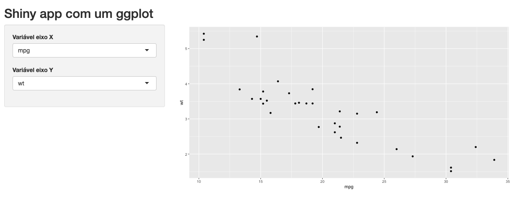

```{r, echo = FALSE}
knitr::opts_chunk$set(
  fig.align = "center"
)
```

# Gráficos

Gráficos são a alegria da festa em um aplicativo Shiny (ou dashboards em geral). Embora possamos usar tabelas, textos ou caixinhas coloridas com valores para comunicar nossos resultados, são eles que geralmente chamam e prendem a atenção de quem está utilizando o app.

Para dar a atenção que eles merecem, farei aqui uma série de posts para apresentar as principais alternativas para construção de gráficos dentro do Shiny. Falaremos dos pacotes `plotly`, `echarts4r` e `highcharter`, mas começaremos na próxima seção pelo nosso fiel companheiro: o `ggplot2`.

## `ggplot2`


O pacote `ggplot2` é uma ferramenta maravilhosa para produzirmos gráficos no R. Quando entendemos a sua sintaxe, nos tornamos capazes de fazer uma variedade enorme de gráficos e dar a eles a cara que quisermos.

Nada do que o pacote `ggplot2` tem para oferecer se perde quando estamos construindo gráficos dentro de um Shiny app. Pelo contrário, ainda ganhamos um novo recurso!

Para inserir um `ggplot` em um aplicativo Shiny, utilizamos a dupla de funções `plotOutput()`/`renderPlot()`. Essas funções estão preparadas para receber um objeto gerado pelas funções do `ggplot` e renderizá-lo em uma **imagem**, que será inserida no HTML do app por meio da tag ``. Veja um exemplo abaixo.

```{r, eval = FALSE}
library(shiny)
library(ggplot2)

colunas <- names(mtcars)

ui <- fluidPage(
  titlePanel("Shiny app com um ggplot"),
  sidebarLayout(
    sidebarPanel(
      selectInput(
        "varX",
        label = "Variável eixo X",
        choices = colunas
      ),
      selectInput(
        "varY",
        label = "Variável eixo Y",
        choices = colunas,
        selected = colunas[6]
      )
    ),
    mainPanel(
      plotOutput("grafico")
    )
  )
)

server <- function(input, output, session) {
  output$grafico <- renderPlot({
    ggplot(mtcars, aes(x = .data[[input$varX]], y = .data[[input$varY]])) +
      geom_point()
  })
}

shinyApp(ui, server)
```

```{r, fig.cap="App com dois inputs especificando as variáveis do eixo x e y de um ggplot .", echo = FALSE}

```

O objeto gerado pela função `ggplot()` é uma lista com classe `gg` e `ggplot`, que contém todas as informações necessárias para o R desenhar o gráfico.

```{r}
library(ggplot2)

p <- ggplot(mtcars, aes(x = wt, y = mpg)) +
  geom_point()

class(p)

names(p)
```

Repare que, se salvássemos o `ggplot` em um arquivo (`.png` por exemplo), poderíamos simplesmente usar a dupla `imageOutput()`/`renderImage()` para inserir um gráfico no nosso app, já que essas funções também criam uma tag ``, mas a partir de um arquivo de imagem local.

Mas não precisar salvar o `ggplot` em um arquivo não é a única vantagem de utilizarmos as funções `plotOutput()`/`renderPlot()`. Essas funções inserem um objeto intermediário no diagrama de reatividade do app: um `plotObj`. Esse objeto é justamente a lista gerada pelas funções que utilizamos na construção do gráfico e que só é recalculado quando um dos inputs existentes no código da função `renderPlot()` muda.

Já o gráfico renderizado depende não apenas desse `plotObj`, mas também do comprimento e altura da janela do navegador de quem estiver utilizando o app. Dessa maneira, o gráfico é renderizado não apenas quando o `plotObj` muda, mas também quando o espaço disponível para a tag `` na tela também muda. Nesse segundo caso, o R gera o gráfico novamente, redesenhando seus elementos para a nova proporção de comprimento e altura. E o melhor é que ele faz isso sem precisar rodar o código da função `renderPlot()` novamente, pois tudo o que ele precisa já está salvo no `plotObj`.

```{r, echo = FALSE, fig.cap="Gráfico sendo redimensionado conforme diminuímos o comprimento da tela."}
knitr::include_graphics("img/redimensionando_janela.gif")
```

Sem esse recurso, nossos gráficos seriam apenas imagens sendo esticadas e achatadas, o que provavelmente os deixaria pixelados. Ao contrário do que acontece no R Markdown, em um relatório HTML ou em um flexdashboard por exemplo, no Shiny não precisamos nos preocupar muito com as dimensões de um `ggplot`. Ele será sempre automaticamente otimizado para o espaço disponível na tela.

Mas nem tudo são flores... Por melhor que consigamos mexer no visual do nosso ggplot utilizando a função `theme()`, no fim do dia ele continuará sendo apenas uma imagem no nosso app. Isso significa que não será possível atribuir a ele qualquer comportamento interativo, como *tooltips*, *drildown* ou ações geradas por cliques no gráfico. Para isso, precisaremos utilizar bibliotecas gráficas próprias para a Web, que geralmente utilizam JavaScript para construir os gráficos e gerar interatividade.

## `plotly`

Muitas vezes, o destino dos nossos gráficos é um Word ou PDF. Nesses casos, independentemente se vamos ler o documento no computador ou na versão impressa, os gráficos precisam ser uma imagem estática. E então o pacote `ggplot2` brilha.

Quando estamos construindo páginas ou aplicações Web (ou apresentações de slides em HTML), além de gráficos em formato de imagem, podemos construir visualizações utilizando bibliotecas JavaScript, que permitem animações e possuem diversas funcionalidades interativas, como *tooltips*, filtros, zoom e drilldrown.

Nesta seção, vamos falar da biblioteca `plotly`, que permite transformarmos rapidamente nossos gráficos feitos com `ggplot2` em gráficos animados e interativos.

Antes de mais nada, precisamos instalar o pacote `plotly`.

```{r, eval = FALSE}
install.packages("plotly")
```

A função mais legal desse pacote é a `plotly::ggplotly()`. Com ela transformamos facilmente um `ggplot` em um gráfico `plotly`.

```{r, message=FALSE, warning = FALSE}
library(ggplot2)
library(plotly)

p <- mtcars |> 
  ggplot(aes(x = wt, y = mpg)) +
  geom_point()

ggplotly(p)
```

Veja que esse gráfico possui um visual muito parecido com o do `ggplot` e, além disso,

- mostra uma *tooltip* quando passamos o cursor em cima de um ponto

- permite selecionar uma área do gráfico para dar zoom;

- e possui uma barra de ferramentas que nos permite aumentar e diminuir o zoom, focar em regiões do gráfico e baixar o gráfico como uma imagem estática.

No exemplo a seguir, além das funcionalidades acima, também podemos clicar na legenda para adicionar ou remover grupos de pontos do gráfico.

```{r}
library(ggplot2)
library(plotly)

p <- mtcars |> 
  ggplot(aes(x = wt, y = mpg, color = as.character(cyl))) +
  geom_point()

ggplotly(p)
```

Para controlar o que aparece na *tooltip*, podemos usar o parâmetro `tooltip`. Veja que adicionamos o modelo do carro e passamos por meio do aes `text`. O tema escolhido para o ggplot é respeitado pelo plotly.

```{r}
library(ggplot2)
library(plotly)

p <- mtcars |> 
  tibble::rownames_to_column() |> 
  ggplot(aes(x = wt, y = mpg, color = as.character(cyl), text = rowname)) +
  geom_point() +
  theme_minimal()

ggplotly(p, tooltip = c("x", "y", "text"))
```

Também podemos construir um gráfico diretamente pelo `plotly`, mas isso exige aprendermos a sintaxe do pacote `plotly` e as opções disponíveis da biblioteca `Plotly`.

```{r}
plot_ly(mtcars, x = ~wt, y = ~mpg, type = "scatter", mode = "markers")
```

Para aprender mais sobre como fazer gráficos diretamente no `plotly`, confira o [tutorial oficial da biblioteca](https://plotly.com/r/getting-started/#next-steps).

Para adicionar um plotly no Shiny, criado a partir da função `ggplotly()` ou da função `plot_ly()`, utilizamos o par de funções `plotly::plotlyOutput()` e `plotly::renderPlotly()`. Na função `renderPlotly()`, basta passarmos um código que retorne um gráfico `plotly`, utilizando os `inputs` para especificar as variáveis.

Rode o app abaixo para ver um exemplo.

```{r, eval = FALSE}
library(shiny)
library(ggplot2)

vars <- names(mtcars)

ui <- fluidPage(
  titlePanel("Plotly"),
  sidebarLayout(
    sidebarPanel(
      selectInput(
        "x",
        "Eixo x",
        choices = vars
      ),
      selectInput(
        "y",
        "Eixo y",
        choices = vars,
        selected = vars[2]
      )
    ),
    mainPanel(
      plotly::plotlyOutput("plot")
    )
  )
)

server <- function(input, output, session) {
  output$plot <- plotly::renderPlotly({
    p <- mtcars |>
      tibble::rownames_to_column() |>
      ggplot(aes(
        x = .data[[input$x]],
        y = .data[[input$y]],
        text = rowname
      )) +
      geom_point() +
      theme_minimal()

    plotly::ggplotly(p)
  })
}

shinyApp(ui, server)
```

## `echarts4r`

No último post, vimos como usar o pacote `plotly` para gerar gráficos dinâmicos do zero ou aproveitando um gráfico feito em `ggplot`. Neste post, falaremos de outra biblioteca gráfica em JavaScript que possui pacote em R: o `echarts`.

O pacote em questão se chama `echarts4r`, portanto, se você ainda não o estiver instalado, rode o código abaixo:

```{r, eval = FALSE}
install.packages("echarts4r")
```

Leia mais:

- [Gráficos no Shiny: ggplot2](https://blog.curso-r.com/posts/2021-10-21-shiny-ggplot2/)

- [Gráficos no Shiny: echarts](https://blog.curso-r.com/posts/2021-11-10-shiny-plotly/)

## O pacote `echarts4r`

O pacote `echarts4r` **não** possui uma função `ggecharts`, equivalente à `ggplotly` do pacote `plotly`, que possibilitaria transformar gráficos feitos em `ggplot` em gráficos `echarts`. Assim, precisamos sempre construir nossos gráficos do zero, usando a sintaxe do `echarts`/`echarts4r`.

O `echarts4r` possui semelhanças e diferenças com relação ao `ggplot2`. A semelhança mais importante é que construímos gráficos em camadas. A primeira diferença relevante é que essas camadas são unidas pelo `%>%`/`|>`, não pelo `+`. Outra diferença é que não temos uma função `aes()`, então o mapeamento das variáveis é feito diretamente nos argumentos das funções.

Vamos começar com um exemplo simples: um gráfico de dispersão.

```{r}
library(echarts4r)

mtcars |> 
  e_charts(x = wt) |> 
  e_scatter(serie = mpg)
```

Veja que o gráfico não possui `tooltip` por padrão. Precisamos incluí-la na pipeline:

```{r}
mtcars |> 
  e_charts(x = wt) |> 
  e_scatter(serie = mpg) |> 
  e_tooltip()
```

Para fazermos um gráfico de linhas, usamos a função `e_line()`. Cada tipo de gráfico será produzido a partir de uma função do tipo `e_*()`, equivalente às funções `geom_*()` no `ggplot2`.

```{r}
ggplot2::txhousing |> 
  dplyr::mutate(year = as.character(year)) |> 
  dplyr::group_by(year) |> 
  dplyr::summarise(sales = mean(sales, na.rm = TRUE)) |> 
  e_charts(x = year) |> 
  e_line(serie = sales) |> 
  e_tooltip()
```

Ao contrário do `ggplot2`, dados agrupados com `dplyr::group_by()` influenciam a construção do gráfico. No código abaixo, a base sai do `summarise` agrupada por `city`, fazendo com que o `echarts` construa uma linha para cada cidade.

```{r}
ggplot2::txhousing |> 
  dplyr::filter(city %in% c("Austin", "Dallas", "Houston")) |> 
  dplyr::mutate(year = as.character(year)) |> 
  dplyr::group_by(city, year) |> 
  dplyr::summarise(sales = mean(sales, na.rm = TRUE)) |> 
  e_charts(x = year) |> 
  e_line(serie = sales) |> 
  e_tooltip()
```


A biblioteca `echarts` possui uma extensa variedade de gráficos disponíveis. Você pode visitar a [galeria de exemplos](https://echarts.apache.org/examples/en/index.html) para ter uma boa ideia do que é possível fazer. Além disso, clicando nos exemplos, você tem acesso aos códigos JavaScript utilizados para construir os gráficos.

Com as funções do pacote `echarts4r`, podemos fazer bastante do que a biblioteca `echarts` tem para oferecer. O que mostramos nesta seção foi tão pouco que nem poderíamos chamar de uma introdução. Para aprender mais sobre o `echarts4r` vale bastante a pena olhar [os tutoriais na página do pacote](https://echarts4r.john-coene.com/index.html).

Em alguns casos, vamos encontrar gráficos ou elementos dentro de um gráfico que não podem ser construídos a partir dos parâmetros das funções do `echarts4r`. Nesses casos, vamos precisar nos socorrer da [documentação do `echarts`](https://echarts.apache.org/en/option.html#title) e usar parâmetros que não estão definidos nas funções do `echarts4r` (o que é possível já que a maioria das funções possuem `...`).

A documentação do `echarts` pode assustar à primeira vista, mas segue um modelo padrão de documentação de bibliotecas JavaScript. Conforme vamos usando mais essas bibliotecas, seja para fazer gráficos, tabelas, mapas ou o que for, vamos nos acostumando a ler essas documentações.

Nesse sentido, uma forma de seguir a maneira JavaScript de construir um `echarts` é usar a função `e_list()`. Com ela, definimos os parâmetros do gráfico a partir de listas e conseguimos reproduzir linha a linha um exemplo feito em JS. A seguir, reproduzimos exatamente [este exemplo](https://echarts.apache.org/examples/en/editor.html?c=pie-borderRadius). Veja que a sintaxe dos dois códigos é muito parecida.

```{r}
e_chart() |> 
  e_list(list(
    tooltip = list(trigger = "item"),
    legend = list(top = "5%", left = "center"),
    series = list(
      list(
        name = "Access From",
        type = "pie",
        radius = c("40%", "70%"),
        avoidLabelOverlap = FALSE,
        itemStyle = list(
          borderRadius = 10,
          borderColor = "#fff",
          borderWidth = 2
        ),
        label = list(show = FALSE, position = "center"),
        emphasis = list(
          label = list(
            show = TRUE, 
            fontSize = 40,
            fontWeight = "bold"
          )
        ),
        labelLine = list(show = FALSE),
        data = list(
          list(value = 1048, name = "Search Engine"),
          list(value = 735, name = "Direct"),
          list(value = 580, name = "Email"),
          list(value = 484, name = "Union Ads"),
          list(value = 300, name = "Video Ads")
        )
      )
    )
  ))
```


Para adicionar um `echarts` no Shiny, utilizamos o par de funções `echarts4r::echarts4rOutput()` e `echarts4r::renderEcharts4r()`. Na função `renderEcharts4r()`, basta passarmos um código que retorne um gráfico `echarts`.

Rode o app abaixo para ver um exemplo.

```{r, eval = FALSE}
library(shiny)
library(echarts4r)

vars <- ggplot2::txhousing |>
  dplyr::select(where(is.numeric), -year, -month, -date) |>
  names()

cidades <- unique(ggplot2::txhousing$city)

ui <- fluidPage(
  titlePanel("echarts"),
  sidebarLayout(
    sidebarPanel(
      selectInput(
        "cidades",
        "Selecione as cidades",
        multiple = TRUE,
        choices = cidades,
        selected = cidades[1]
      ),
      selectInput(
        "serie",
        "Selecione a série",
        choices = vars,
        selected = vars[1]
      )
    ),
    mainPanel(
      echarts4r::echarts4rOutput("plot")
    )
  )
)

server <- function(input, output, session) {
  output$plot <- echarts4r::renderEcharts4r({
    ggplot2::txhousing |>
      dplyr::filter(city %in% input$cidades) |>
      dplyr::mutate(year = as.character(year)) |>
      dplyr::group_by(city, year) |>
      dplyr::summarise(avg_serie = mean(.data[[input$serie]], na.rm = TRUE)) |>
      e_charts(x = year) |>
      e_line(serie = avg_serie) |>
      e_tooltip()
  })
}

shinyApp(ui, server)

```

## `highcharter`
