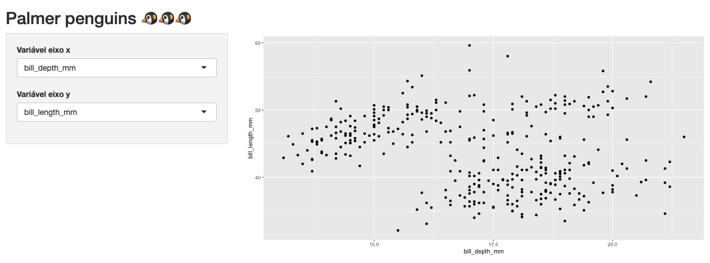

## O que é um aplicativo Shiny?

Na tentativa de explicar o que é um aplicativo Shiny, podemos reduzi-lo a diversos elementos.

Um aplicativo Shiny é um site, uma página na web. Ele terá um endereço (URL) que, quando acessado, exibirá informações em forma de texto, imagens e vídeo^[Embora seja bem incomum mostrar vídeos em um Shiny app, também é possível.]. Ser uma página web também significa que ele será constituído de HTML, CSS e JavaScript. Se você não conhece essas linguagens, uma boa maneira de entender o papel de cada uma delas na construção de um site é pensar em uma casa. 

Podemos pensar o HTML como a estrutura física da casa: chão, paredes, colunas, teto, encanamento, fiação etc; o CSS é o responsável pela aparência: pintura, pisos, azulejos, decoração em geral; e o JavaScript traz funcionalidades a cada cômodo: pia, vaso sanitário, geladeira, cama, televisão e por aí vai. 

Com o Shiny, construiremos essa casa utilizando funções de R.

Um aplicativo Shiny também é um aplicativo web. Isso significa que, além de exibir informações, o nosso site/aplicativo também permetirá que quem estiver acessando intereja com as visualizações apresentadas. Essa interação gera um componente fundamental de um Shiny app: o servidor. Todo aplicativo Shiny será hospedado em um servidor com uma sessão de R rodando.

Por fim, um aplicativo Shiny também é um código (ou uma coleção de códigos) em linguagem R. O pacote `{shiny}` (ao lado de  muitos outros pacotes criados pela RStudio e pela comunidade) possui funções que (1) criam a estrutura e o visual do site/aplicativo, (2) montam a lógica de comunicação entre a pessoa que está utilizando o app e o servidor e (3) permite a construção da lógica interna do aplicativo, onde criamos as visualizações que serão exibidas na página a partir de código R puro. Esse último item significa que podemos utilizar todo arsenal de manipulação, visualização e modelagem do R em nossos aplicativos Shiny!

Além dessas definições, ainda há diversos pontos sobre implantação e hospedagem dos aplicativos para completar a discussão sobre o framework Shiny. Esses tópicos serão tratados mais a frente neste livro, no Capítulo XX.

Na próxima seção, mostraremos como todos esses elementos de um aplicativo Shiny são traduzidos para um código em R.

## Os componentes básicos

Se dividirmos a construção de um aplicativo Shiny em duas partes, uma delas seria a construção do código HTML. Você precisa determinar explicitamente quais são e onde ficam as paredes do seu app. Isso quer dizer que, sempre que programar um Shiny app, você terá programado ao menos em HTML^[Assim como toda casa precisa de alguma estrutura física, não faz sentido pensarmos em CSS e JavaScript sem o HTML. Podemos construir um site apenas em HTML, mas sem ele não temos onde aplicar o CSS e o JavaScript.], mesmo que sem saber.

A princípio, você não precisará se preocupar com CSS, pois a aparência padrão do Shiny^[Isto é, o código CSS que o Shiny já utiliza por padrão.] já é bem aceitável. O mesmo vale para o JavaScript: quando você programa em Shiny, todo o JavaScript necessário para o seu app funcionar corretamente já está pronto e será utilizado automaticamente.

Podemos pensar na programação desse código HTML como a construção daquilo que será mostrado na tela, a cara do seu app, a **UI** (sigla para o termo *user interface*, em inglês). Das definições apresentadas na seção anterior, a UI corresponde à página web. A figura a seguir mostra a UI de um app bem simples, que permite a escolha de duas variáveis e apresenta um gráfico de dispersão delas:

```{r, echo = FALSE, fig.cap="UI de um app simples.", fig.alt = "UI de um app simples."}

```

Mas como criamos esse código HTML sem saber HTML? A resposta é simples: utilizando funções do R que retornam código HTML. Esse é um dos papéis do pacote `{shiny}` e um dos desafios da programação em Shiny. Não precisaremos aprender HTML formalmente, mas precisaremos aprender quais funções utilizar para construir uma UI bem estruturada.

A segunda parte da construção de um aplicativo Shiny é aquilo não será visto por quem utilizar o app: o **servidor**. O lado do servidor (*server side* ou simplesmente *server*, em inglês) contém toda a lógica para a construção das saídas apresentadas na UI. Na figura anterior, o código que gera o gráfico de dispersão fica dentro do servidor.

Embora precisemos aprender alguns conceitos e regras novas, a maior parte do código que compõe o servidor é aquele bom e velho R que já utilizamos no dia-a-dia para gerar tabelas, gráficos e qualquer outro tipo de visualização. Em resumo, para fazer um ggplot aparecer no Shiny, basta adaptar o código que gera esse gráfico para receber as entradas de quem estiver usando o app (*inputs*) e devolver o resultado (*output*) no *lugar* adequado.

A UI e o servidor são os dois componentes básicos de um aplicativo Shiny. Embora sejam construídos separadamente, eles estão altamente interligados e a correta conexão desses componentes é o que gera a interatividade do Shiny. Em qualquer app, teremos sempre requisições sendo feitas pela UI, processadas pelo servidor e seus resultados devolvidos à UI. Esse processo está resumido no esquema a seguir:

```{r, echo = FALSE, fig.cap="Esquema UI/servidor de um aplicativo Shiny.", fig.alt="Esquema UI/servidor de um aplicativo Shiny."}
knitr::include_graphics("img/esquema_ui_servidor.png")
```

Na próxima seção, vamos mostrar como colocar tudo isso dentro do código, apresentando como construímos a UI e o servidor utilizando o pacote `{shiny}`.

## Estrutura de um código Shiny

## Rodando um aplicativo
