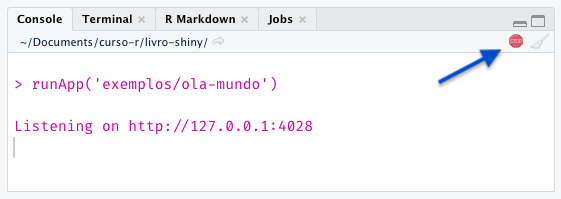

## O que é um aplicativo Shiny?

Na tentativa de explicar o que é um aplicativo Shiny, podemos reduzi-lo a diversos elementos.

Um aplicativo Shiny é um site, uma página na web. Ele terá um endereço (URL) que, quando acessado, exibirá informações em forma de texto, imagens e vídeo^[Embora seja bem incomum mostrar vídeos em um Shiny app, também é possível.]. Ser uma página web também significa que ele será constituído de HTML, CSS e JavaScript. Se você não conhece essas linguagens, uma boa maneira de entender o papel de cada uma delas na construção de um site é pensar em uma casa. 

Podemos pensar o HTML como a estrutura física da casa: chão, paredes, colunas, teto, encanamento, fiação etc; o CSS é o responsável pela aparência: pintura, pisos, azulejos, decoração em geral; e o JavaScript traz funcionalidades a cada cômodo: pia, vaso sanitário, geladeira, cama, televisão e por aí vai. 

Com o Shiny, construiremos essa casa utilizando funções de R.

Um aplicativo Shiny também é um aplicativo web. Isso significa que, além de exibir informações, o nosso site/aplicativo também permetirá que quem estiver acessando intereja com as visualizações apresentadas. Essa interação gera um componente fundamental de um Shiny app: o servidor. Todo aplicativo Shiny será hospedado em um servidor com uma sessão de R rodando.

Por fim, um aplicativo Shiny também é um código (ou uma coleção de códigos) em linguagem R. O pacote `{shiny}` (ao lado de  muitos outros pacotes criados pela RStudio e pela comunidade) possui funções que (1) criam a estrutura e o visual do site/aplicativo, (2) montam a lógica de comunicação entre a pessoa que está utilizando o app e o servidor e (3) permite a construção da lógica interna do aplicativo, onde criamos as visualizações que serão exibidas na página a partir de código R puro. Esse último item significa que podemos utilizar todo arsenal de manipulação, visualização e modelagem do R em nossos aplicativos Shiny!

Além dessas definições, ainda há diversos pontos sobre implantação e hospedagem dos aplicativos para completar a discussão sobre o framework Shiny. Esses tópicos serão tratados mais a frente neste livro, no Capítulo XX.

Na próxima seção, mostraremos como todos esses elementos de um aplicativo Shiny são traduzidos para um código em R.

## Os componentes básicos

Um aplicativo Shiny tem dois componentes básicos: a **interface de usuário** e o **servidor**.

O primeiro componente se refere à construção do código HTML que compõe o app. Retomando a analogia da casa, você precisa determinar explicitamente quais são e onde ficam *as paredes* do seu aplicativo. Isso quer dizer que, sempre que programar um Shiny app, você terá programado ao menos em HTML^[Assim como toda casa precisa de alguma estrutura física, não faz sentido pensarmos em CSS e JavaScript sem o HTML. Podemos construir um site apenas em HTML, mas sem ele não temos onde aplicar o CSS e o JavaScript.], mesmo que sem saber.

A princípio, você não precisará se preocupar com CSS, pois a aparência padrão do Shiny^[Isto é, o código CSS que o Shiny já utiliza por padrão.] já é bem aceitável. O mesmo vale para o JavaScript: quando você programa em Shiny, todo o JavaScript necessário para o seu app funcionar corretamente já está pronto e será utilizado automaticamente.

Podemos pensar na programação desse código HTML como a construção daquilo que será mostrado na tela, a cara do seu app, a interface de usuário ou **UI** (sigla para o termo *user interface*, em inglês). Das definições apresentadas na seção anterior, a UI corresponde à página web. A figura a seguir mostra a UI de um app bem simples, que permite a escolha de duas variáveis e apresenta o gráfico de dispersão delas:

```{r, echo = FALSE, fig.cap="UI de um app simples.", fig.alt = "UI de um app simples."}

```

O segundo componente se refere àquilo que não será visto por quem utilizar o app: o **servidor**. O lado do servidor (*server side* ou simplesmente *server*, em inglês) contém toda a lógica para a construção das visualizações apresentadas na UI. Na figura anterior, o código que gera o gráfico de dispersão fica dentro do servidor.

Embora precisemos aprender alguns conceitos e regras novas, a maior parte do código que compõe o servidor é aquele bom e velho R que já utilizamos no dia-a-dia para gerar tabelas, gráficos e qualquer outro tipo de visualização. Em resumo, para fazer um ggplot aparecer no Shiny, basta adaptar o código que gera esse gráfico para receber as entradas de quem estiver usando o app (*inputs*) e devolver o resultado (*output*) no *lugar* adequado.

A UI e o servidor são os dois componentes básicos de um aplicativo Shiny. Embora sejam construídos separadamente, eles estão altamente interligados e a correta conexão desses componentes é o que gera a interatividade do Shiny. Em qualquer app, teremos sempre requisições sendo feitas pela UI, processadas pelo servidor e seus resultados devolvidos à UI. Esse processo está resumido no esquema a seguir:

```{r, echo = FALSE, fig.cap="Esquema UI/servidor de um aplicativo Shiny.", fig.alt="Esquema UI/servidor de um aplicativo Shiny."}
knitr::include_graphics("img/esquema_ui_servidor.png")
```

Você pode acessar o app utilizado como exemplo nesta seção [clicando aqui](https://cursodashboards.shinyapps.io/penguins-dispersao/). Dado o esquema apresentado na figura anterior, tente imaginar o que está acontecendo sempre que você seleciona uma nova variável dentro do app. Como o novo gráfico é gerado? Qual é o papel do servidor? Como ele se comunica com a UI que você está vendo?

Na próxima seção, vamos começar a responder essas perguntas mostrando como construímos a UI e o servidor de um Shiny app utilizando o pacote `{shiny}`.

## Estrutura de um código Shiny

Na seção anterior, dissemos que a construção da UI corresponde à construção do código HTML que compõe o aplicativo. Fazemos isso utilizando funções do R que retornam HTML. Esse é um dos papéis do pacote `{shiny}` e um dos desafios da programação em Shiny. **Não precisaremos aprender HTML formalmente, mas precisaremos aprender quais funções utilizar para construir uma UI bem estruturada**.

Também dissemos anteriormente que o servidor é responsável por conectar os *inputs* e *outputs* do aplicativo receber os códigos que geram as visualizações apresentadas na UI. No código, isso sempre será feito dentro de uma função chamada `server`. 

Com isso em mente, o código de qualquer aplicativo Shiny terá a estrutura abaixo:

- um objeto chamado `ui`;

- uma função chamada `server`;

- e uma chamada da função `shinyApp()`.

Como exemplo, observe o código a seguir. Ele representa um dos aplicativos mais simples que podemos construir:

```{r, eval=FALSE}
library(shiny)

ui <- fluidPage("Olá, mundo!")

server <- function(input, output, session) {
  
}

shinyApp(ui, server)
```

Esse código resultará no *aplicativo* com a seguinte UI:

```{r, echo = FALSE, fig.cap='UI do aplicativo "Olá, mundo!".', fig.alt="UI do aplicativo Olá, mundo!"}
knitr::include_graphics("img/app_ola_mundo.png")
```

Vejam que a UI se trata apenas de uma página de fundo branco com a frase "Olá, mundo!" escrita no canto superior esquerdo. O app não possui nenhuma interatividade.

Olhando o código anterior, encontramos a frase "Olá, mundo!" na definição do objeto `ui`, dentro da função `fluidPage()`. Essa função do pacote `{shiny}` é uma entre várias que utilizaremos para retornar código HTML. Falaremos mais dela no próximo capítulo.

```{r, eval = FALSE}
ui <- fluidPage("Olá, mundo!")
```

O importante por enquanto é sabermos que **o objeto `ui` é responsável por receber todo o código HTML do nosso aplicativo**, código que será criado a partir de funções em R que retornam HTML.

A função `server` sempre receberá os argumentos `input`, `output` e `session`^[O argumento `session` pode ser omitido em alguns casos. Falaremos mais sobre isso no Capítulo XXX]. A partir desses argumentos, montaremos a lógica interativa (ou reativa, guarde esse nome) do app. O código que gera as visualizações será escrito dentro dessa função. Como o nosso app *Olá, mundo!* não possui visualizações ou interatividade, a sua função `server` está vazia^[A função `server` sempre precisa existir, mesmo neste caso, quando não há interatividade].

```{r}
server <- function(input, output, session) {
  # O código do server seria colocado aqui.
}
```

A última linha de código do nosso pequeno app contém a chamada `shinyApp(ui, server)`. Essa função vai juntar o objeto `ui` e a função `server`, construir toda a arquitetura necessária e rodar o seu aplicativo. Não discutiremos aqui como tudo isso é feito pois envolve tópicos fora do escopo de um material introdutório. Por enquanto, é importante lembrar que **essa função sempre deve ser chamada ao fim do código de um Shiny app**. Voltaremos a falar dela no Capítulo XX.

Na próxima seção, vamos discutir como rodar localmente um aplicativo Shiny e o que acontece no nosso computador quando estamos fazendo isso. 

## Rodando um aplicativo

Para fazer o seu primeiro aplicativo em Shiny, abra o RStudio e copie o código do app *Olá, mundo!* (apresentado novamente a seguir) em um arquivo chamado `app.R`. Recomendamos fortemente que vocês utilizem [projetos](https://livro.curso-r.com/2-3-projetos.html) e que, neste primeiro momento, sempre salvem o código dos aplicativos na raiz do projeto.

```{r, eval=FALSE}
library(shiny)

ui <- fluidPage("Olá, mundo!")

server <- function(input, output, session) {
  
}

shinyApp(ui, server)
```

Repare que algumas opções novas aparecerão no RStudio quando salvamos o arquivo. Isso acontece porque o RStudio reconhece a sintaxe do código como a de um aplacativo Shiny, habilitando para nós algumas ferramentas que são úteis apenas para trabalhar com apps. A mais importante por enquanto será o botão **Run App**.

Como discutimos anteriormente, um aplicativo Shiny em funcionamento sempre terá um computador rodando uma sessão de R por trás. Esse computador, chamado genericamente de *servidor*, pode ser uma máquina virtual em um serviço de nuvem, uma máquina virtual em um serviço de hospedagem, um servidor dentro da sua empresa, um servidor na sua casa ou mesmo o seu próprio computador pessoal.

Normalmente, enquanto estamos desenvolvendo um aplicativo Shiny, queremos testá-lo localmente^[E locamente também.] para verificar se tudo funciona corretamente, se está ficando bonito ou simplesmente para gastar alguns minutos apreciando a nossa obra de arte. Testar localmente significa que **o seu próprio computador fará as vezes de servidor**, embora isso não signifique que seu app ficará disponível na internet.

Quando servimos um app localmente, isto é, quando *rodamos um app*, ganhamos um endereço que será acessível apenas do nosso computador. A partir desse endereço, podemos testar nosso app no navegador, como se ele já estivesse em produção. No RStudio, para rodar nossos apps, utilizamos justamente o botão **Run App**.

```{r, echo = FALSE, fig.alt="Botão Run App no Rstudio. Fica logo acima do script.", fig.cap="Botão Run App no Rstudio."}
knitr::include_graphics("img/botao_run_app.png")
```

Ao clicar nesse botão, o seu navegador padrão será aberto e você verá a UI do nosso modesto app com apenas a frase "Olá, mundo!".

Se você voltar ao RStudio, eventualmente vai notar algo muito importante: a sua sessão de R estará ocupada! Mas isso não deveria ser uma surpresa, pois já discutimos que todo Shiny app tem uma sessão de R rodando por trás, então, quando estamos rodando o aplicativo no nosso próprio computador, a sessão de R escolhida para servir o app precisa ser essa.

Essa sessão fornece a comunicação da UI (ou do nosso navegador) com o servidor e é responsável por atualizar as visualizações apresentadas na UI, sempre que alguém interagir com o app. Embora o nosso app *Olá, mundo* não possuir interatividade, a estrutura necessária para que a interatividade aconteça ainda assim é criada pelo Shiny.

Para liberar a sessão, basta clicar no botão "*stop*", na parte de cima do Console, ou pressionar a tecla `Esc`. Veja que, ao fazer isso, a tela do app ficará acizentada, indicando que ele foi desconectado do servidor e não funcionará mais corretamente.

```{r, echo = FALSE, fig.alt="Console do RStudio com sinal de ocupado (stop).", fig.cap="Veja que o sinal de *stop* identifica que a sessão de R está ocupada."}

```

No console, após rodarmos o R, também aparecerá uma mensagem idenficicando o *endereço* do nosso aplicativo. Nesse caso, será um IP (`http://127.0.0.1`)^[Esse número de IP é padrão e significa "o seu computador".] com alguma porta que esteja disponível escolhida aleatoriamente (`:4028`). Esse endereço aparecerá no nosso navegador e poderemos copiá-lo e colá-lo em qualquer outra aba ou navegador que quisermos rodar o app.


