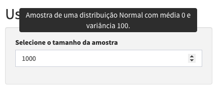
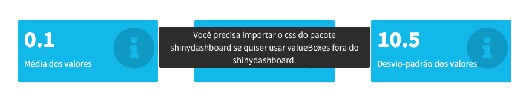
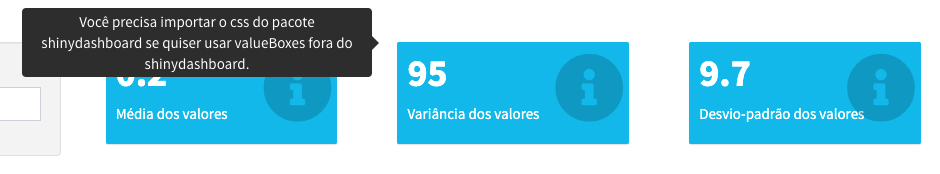

```{r, echo = FALSE}
knitr::opts_chunk$set(
  fig.align = "center"
)
```

# Miscelânea

## Caixas de diálogo

## Tooltips

*Tooltips* são uma ótima maneira de se comunicar com a pessoa utilizando o seu app, pois permitem passar todo tipo de informação extra e não oculpam espaço da UI.

Essencialmente, elas são textos que só aparecem quando passamos o ponteiro do mouse em algum elemento da tela. Por exemplo, passe o mouse em cima da frase a seguir:

`r tippy::tippy("Passe o mouse aqui!", tooltip = "Olá! Eu sou uma tooptip :)")`aqui.

Existem várias soluções disponíveis para incluirmos *tooltips* em um aplicativo Shiny, entre elas o pacote `tippy`.

Esse pacote está no CRAN, então basta rodar o código abaixo para instalá-lo:

```{r, eval = FALSE}
install.packages("tippy")
```


Para colocar uma *tooltip* em um elemento do seu app, basta usar a função `with_tippy()`.

```{r, eval = FALSE}
tippy::with_tippy(
  numericInput(
    "tamanho",
    label = "Selecione o tamanho da amostra",
    value = 1000,
    step = 1000
  ),
  tooltip = "Amostra de uma distribuição Normal com média 0 e variância 100."
)
```

```{r, echo = FALSE, out.width="70%"}

```


Você também pode aplicar a mesma *tooltip* a vários elementos utilizando a função `tippy_class()`.

```{r, eval = FALSE}
fluidRow(
  column(
    width = 4,
    div(
      class = "valuebox-tip",
      shinydashboard::valueBoxOutput("valor_1", width = 12)
    )
  ),
  column(
    width = 4,
    div(
      class = "valuebox-tip",
      shinydashboard::valueBoxOutput("valor_2", width = 12)
    )
  ),
  column(
    width = 4,
    div(
      class = "valuebox-tip",
      shinydashboard::valueBoxOutput("valor_3", width = 12)
    )
  ),
  column(
    width = 12,
    plotOutput("grafico")
  ),
  tippy::tippy_class(
    "valuebox-tip",
    content = "Você precisa importar o css do pacote shinydashboard se quiser usar valueBoxes fora do shinydashboard."
  )
)
```

```{r, echo = FALSE, out.width="90%"}

```

Você pode customizar a *tooltip* seguindo os parâmetros da [documentação oficial da biblioteca `tippy.js`](https://atomiks.github.io/tippyjs/v6/all-props/).

```{r, eval = FALSE}
tippy::tippy_class(
  "valuebox-tip",
  content = "Você precisa importar o css do pacote shinydashboard se quiser usar valueBoxes fora do shinydashboard.",
  arrow = TRUE,
  placement = "left"
)
```

```{r, echo = FALSE, out.width="90%"}

```

Os fragmentos de código acima pertencem ao app a seguir. Rode o app para ver as *tooltips* em funcionamento.

```{r, eval = FALSE}
library(shiny)

ui <- fluidPage(
  shinyWidgets::useShinydashboard(),
  titlePanel("Usando tooltips"),
  sidebarLayout(
    sidebarPanel(
      tippy::with_tippy(
        numericInput(
          "tamanho",
          label = "Selecione o tamanho da amostra",
          value = 1000,
          step = 1000
        ),
        tooltip = "Amostra de uma distribuição Normal com média 0 e variância 100."
      )
    ),
    mainPanel(
      fluidRow(
        column(
          width = 4,
          div(
            class = "valuebox-tip",
            shinydashboard::valueBoxOutput("valor_1", width = 12)
          )
        ),
        column(
          width = 4,
          div(
            class = "valuebox-tip",
            shinydashboard::valueBoxOutput("valor_2", width = 12)
          )
        ),
        column(
          width = 4,
          div(
            class = "valuebox-tip",
            shinydashboard::valueBoxOutput("valor_3", width = 12)
          )
        ),
        column(
          width = 12,
          plotOutput("grafico")
        ),
        tippy::tippy_class(
          "valuebox-tip",
          content = "Você precisa importar o css do pacote shinydashboard se quiser usar valueBoxes fora do shinydashboard.",
          arrow = TRUE,
          placement = "left"
        )
      )
    )
  )
)

server <- function(input, output, session) {
  
  amostra <- reactive(rnorm(input$tamanho, sd = 10))
  
  output$valor_1 <- shinydashboard::renderValueBox({
    shinydashboard::valueBox(
      value = round(mean(amostra()), 1),
      subtitle = "Média dos valores",
      icon = icon("info-circle")
    )
  })
  
  output$valor_2 <- shinydashboard::renderValueBox({
    shinydashboard::valueBox(
      value = round(var(amostra()), 1),
      subtitle = "Variância dos valores",
      icon = icon("info-circle")
    )
  })
  
  output$valor_3 <- shinydashboard::renderValueBox({
    shinydashboard::valueBox(
      value = round(sd(amostra()), 1),
      subtitle = "Desvio-padrão dos valores",
      icon = icon("info-circle")
    )
  })
  
  output$grafico <- renderPlot(hist(amostra()))
  
}

shinyApp(ui, server)

```


## Animações de carregamento

É muito comum termos visualizações no nosso app que demoram para serem geradas. Quando estamos carregando o app, isso pode fazer com que parte da UI fique em branco, parecendo que a página está quebrada ou fazendo com que alguém passe em branco pelo output que você teve tanto trabalho para fazer. Quando a visualização está sendo recalculada, o padrão do Shiny é deixar a versão anterior acizentada até que a nova apareça, o que pode gerar estranheza e também passar a ideia de que o aplicativo quebrou.

É uma boa prática sempre avisarmos a quem estiver usando o app que alguma coisa está acontecendo por trás das cortinas. Quando a espera é muito longa, devemos sempre que possível explicar o porquê a pessoa está esperando e dar uma estimativa do tempo. Nesses casos, barras de carregamento são a melhor alternativa. Falaremos delas na próxixa seção.

Quando a espera não é tão grande (entre 2 e 10 segundos, por exemplo), animações giratórias ou de looping infinito podem ser utilizadas para indicar que algo vai aparecer ali e reduzir um pouco a percepção do tempo de espera.

Nesta seção, falaremos de dois pacotes que deixam muito simples a tarefa de incluir essas animações em nossos outputs: o `shinycssloaders` e o `shinyWidgets`.

Se você ainda não tem esses pacotes instalados, ambos estão no CRAN:

```{r, eval = FALSE}
install.packages("shinycssloaders")
install.packages("shinyWidgets")
```

O `shinycssloaders` é um pacote mantido pelo [Dean Attali](https://github.com/daattali) que possui uma única função: `withSpinner()`. Para colocar a animação de carregamento em uma visualização, basta colocar a função `*Output()` dentro da função `withSpinner()`! Sempre que ela estiver sendo calculada, um *spinner* será mostrado no lugar.

Rode o Shiny app abaixo para ver um exemplo:

```{r, eval = FALSE}
library(shiny)

ui <- fluidPage(
  titlePanel("Exemplo shinyWidgets::addSpinner"),
  sidebarLayout(
    sidebarPanel(
      selectInput(
        inputId = "variavel",
        label = "Escolha uma variável",
        choices = names(mtcars)
      )
    ),
    mainPanel(
      shinycssloaders::withSpinner(
        plotOutput(outputId = "histograma"),
        type = 4,
        color = "orange",
        size = 2
      )
    )
  )
)

server <- function(input, output, session) {

  output$histograma <- renderPlot({
    Sys.sleep(5)
    hist(mtcars[[input$variavel]])
  })


}

shinyApp(ui, server)

```

Além de 8 opções de animações diferentes, que você pode trocar no argumento `type`, também é possível ajustar o tamanho, a cor, a cor de fundo e até usar uma imagem própria como animação^[Pode ser uma imagem estática ou GIF.].

Veja [aqui](https://daattali.com/shiny/shinycssloaders-demo/) um Shiny app que apresenta todas as opções de customização do `shinycssloaders`.

O pacote shinyWidgets é mantido pelo pessoal da [dreamRs](https://github.com/dreamRs). Além de diversos widgets muito úteis ^[Alguns deles serão apresentados nas próximas seções.], ele possui a função `addSpinner()`. Assm como a função `shinycssloards::withSpinner()`, basta embrulhar suas funções `*Output()` com a função `addSpinner()` para adicionar a animação às suas visualizações.

São 9 opções de animação, escolhidas por meio do argumento `spin`. Aqui você pode customizar apenas a cor delas. Rode o app a seguir para ver um exemplo.

```{r, eval = FALSE}
library(shiny)

ui <- fluidPage(
  titlePanel("Exemplo shinyWidgets::addSpinner"),
  sidebarLayout(
    sidebarPanel(
      selectInput(
        inputId = "variavel",
        label = "Escolha uma variável",
        choices = names(mtcars)
      )
    ),
    mainPanel(
      shinyWidgets::addSpinner(
        plotOutput(outputId = "histograma"),
        spin = "cube",
        color = "purple"
      )
    )
  )
)

server <- function(input, output, session) {

  output$histograma <- renderPlot({
    Sys.sleep(5)
    hist(mtcars[[input$variavel]])
  })


}

shinyApp(ui, server)

```

## Barras de carregamento

## Markdown

## Seletor de visualizações

Nesta seção, vamos mostrar como usar o widget `radioGroupButtons` do pacote `shinyWidgets` para construir um [app com seletor de visualizações](https://acursor.shinyapps.io/seletor-visualizacoes/), isto é, botões que mudam o tipo de visualização apresentada na tela.

Como exemplo, vamos construir um shiny app que mostra um gráfico de barras, um gráfico de linhas ou uma tabela (a depender da escolha da pessoa que estiver usando) do número de gols do Brasileirão^[Campeonato Brasileiro de futebol da Série A.] por temporada.

O primeiro passo é configurar o widget corretamente. Veja abaixo que o segredo é utilizar os argumentos `choiceValues` e `choiceNames`. Para o primeiro, passamos os valores que serão acessados dentro do `server` a depender da escolha na UI (equivalente ao argumento `choices`). Ao segundo, podemos passar tanto textos (que seriam escritos dentro do botão) quanto ícones. Nesse caso, utilizamos ícones da biblioteca [Font Awesome](https://fontawesome.com/), com ajuda da função `shiny::icon()`. Repare também que deixamos o tamanho dos botões um pouco maiores setando o argumento `size = "lg`.

```{r, eval = FALSE}
shinyWidgets::radioGroupButtons(
  inputId = "vis_escolhida",
  label = "",
  choiceValues = c("barras", "linhas", "tabela"),
  choiceNames = list(
    icon("bar-chart"),
    icon("line-chart"),
    icon("table")
  ),
  size = "lg",
  selected = "barras"
)
```


Agora, precisamos construir a lógina do Output, tanto na UI como no server. Como a nossa visualização pode gerar gráficos ou uma tabela, precisaremos de funções `*Output()` e `render*()` diferentes. Dessa forma, vamos utilizar na nossa UI um `OutputUI()`.

```{r, eval = FALSE}
# A nossa UI ficará assim
ui <- fluidPage(
  fluidRow(
    column(
      width = 12,
      h1("App com seletor de visualizações")
    )
  ),
  br(),
  fluidRow(
    column(
      offset = 1,
      width = 11,
      shinyWidgets::radioGroupButtons(
        inputId = "vis_escolhida",
        label = "",
        choiceValues = c("barras", "linhas", "tabela"),
        choiceNames = list(
          icon("bar-chart"),
          icon("line-chart"),
          icon("table")
        ),
        size = "lg",
        selected = "barras"
      )
    )
  ),
  br(),
  fluidRow(
    column(
      width = 12,
      uiOutput("vis")
    )
  )
)
```


Agora, no server, podemos criar funções `*Output()` diferentes a depender da visualização escolhida. Usamos `plotOutput()` para os gráficos e `reactable::reactableOutput()` para a tabela.

```{r, eval = FALSE}
output$vis <- renderUI({
  if (input$vis_escolhida %in% c("barras", "linhas")) {
    plotOutput("grafico")
  } else if (input$vis_escolhida == "tabela") {
    reactable::reactableOutput("tabela")
  }
})
```

Agora vamos construir nossas visualizações. Primeiro, vamos montar a base que precisamos para gerar tanto os gráficos quanto a tabela.

Os dados vêm do pacote `brasileirao`. Se você não possui esse pacote instalado, basta rodar o código abaixo:

```{r, eval = FALSE}
remotes::install_github("williamorim/brasileirao")
```

Como a tabela que gera os gráficos não depende de nenhum valor ou expressão reativa, podemos colocar o código que a gera diretamente no server.

```{r, eval = FALSE}
tab <- brasileirao::matches |>
  dplyr::filter(
    score != "x",
    season %in% 2006:2020
  ) |>
  tidyr::separate(
    score,
    c("gols_casa", "gols_visitante"),
    sep = "x",
    convert = TRUE
  ) |>
  dplyr::mutate(
    gols = gols_casa + gols_visitante
  ) |>
  dplyr::group_by(season) |>
  dplyr::summarise(gols = sum(gols))
```


Para gerar os gráficos, só precisamos de um `renderPlot()` e um `if/else` para devolver o gráfico certo. 

```{r, eval = FALSE}
output$grafico <- renderPlot({
  
  grafico_base <- tab |>
    ggplot(aes(x = season, y = gols)) +
    labs(x = "Temporada", y = "Número de gols") +
    theme_minimal() +
    ggtitle("Número de gols do Brasileirão por temporada")
  
  if (input$vis_escolhida == "linhas") {
    grafico_base +
      geom_line(color = "dark green")
  } else if (input$vis_escolhida == "barras") {
    grafico_base +
      geom_col(width = 0.5, fill = "dark green")
  }
})
```

Para gerar a tabela, precisamos apenas de um `renderReactable()`.

```{r}
output$tabela <- reactable::renderReactable({
  tab |>
    reactable::reactable(
      fullWidth = FALSE,
      columns = list(
        season = reactable::colDef(
          name = "Temporada"
        ),
        gols = reactable::colDef(
          name = "Número de gols"
        )
      )
    )
})
```

Juntando tudo, temos o app a seguir:

```{r, eval = FALSE}
library(shiny)
library(ggplot2)

ui <- fluidPage(
  fluidRow(
    column(
      width = 12,
      h1("App com seletor de visualizações")
    )
  ),
  br(),
  fluidRow(
    column(
      offset = 1,
      width = 11,
      shinyWidgets::radioGroupButtons(
        inputId = "vis_escolhida",
        label = "",
        choiceValues = c("barras", "linhas", "tabela"),
        choiceNames = list(
          icon("bar-chart"),
          icon("line-chart"),
          icon("table")
        ),
        size = "lg",
        selected = "barras"
      )
    )
  ),
  br(),
  fluidRow(
    column(
      width = 12,
      uiOutput("vis")
    )
  )
)

server <- function(input, output, session) {

  output$vis <- renderUI({
    if (input$vis_escolhida %in% c("barras", "linhas")) {
      plotOutput("grafico")
    } else if (input$vis_escolhida == "tabela") {
      reactable::reactableOutput("tabela")
    }
  })

  tab <- brasileirao::matches |>
    dplyr::filter(
      score != "x",
      season %in% 2006:2020
    ) |>
    tidyr::separate(
      score,
      c("gols_casa", "gols_visitante"),
      sep = "x",
      convert = TRUE
    ) |>
    dplyr::mutate(
      gols = gols_casa + gols_visitante
    ) |>
    dplyr::group_by(season) |>
    dplyr::summarise(gols = sum(gols))

  output$grafico <- renderPlot({

    grafico_base <- tab |>
      ggplot(aes(x = season, y = gols)) +
      labs(x = "Temporada", y = "Número de gols") +
      theme_minimal() +
      ggtitle("Número de gols do Brasileirão por temporada")

    if (input$vis_escolhida == "linhas") {
      grafico_base +
        geom_line(color = "dark green")
    } else if (input$vis_escolhida == "barras") {
      grafico_base +
        geom_col(width = 0.5, fill = "dark green")
    }
  })

  output$tabela <- reactable::renderReactable({
    tab |>
      reactable::reactable(
        fullWidth = FALSE,
        columns = list(
          season = reactable::colDef(
            name = "Temporada"
          ),
          gols = reactable::colDef(
            name = "Número de gols"
          )
        )
      )
  })
}

shinyApp(ui, server)

```
